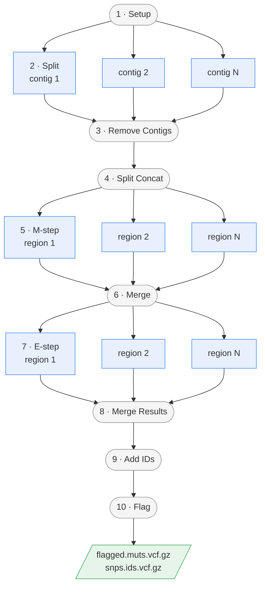

# 🗿 nf-caveman

[](https://github.com/eliko1991/nf-caveman/actions/workflows/ci.yml)

A Nextflow pipeline for running the [CaVEMan](https://cancerit.github.io/CaVEMan/) algorithm for somatic SNV calling.

## Introduction

**nf-caveman** is a Nextflow implementation of the CaVEMan (Cancer Variants through Expectation Maximisation) somatic variant calling pipeline. It is a direct port of the [toil_caveman](https://github.com/papaemmelab/toil_caveman) Toil-based pipeline, maintaining the same parameter names for easy migration.

The pipeline wraps [cgpCaVEManWrapper](https://github.com/cancerit/cgpCaVEManWrapper) which provides the reference implementation of the CaVEMan SNV analysis workflow.

## Pipeline Summary

Three steps fan out — **Split** to one task per reference contig, **M-step** and **E-step**
to one task per split region. Everything else is a single task.



1. **Setup** - Initialize CaVEMan working directory
2. **Split** - Split genome into chunks, **one task per reference contig**
3. **Remove Contigs** - Remove unwanted contigs (GL, hs, MT, NC)
4. **Split Concat** - Concatenate split files
5. **M-step** - Mutation step, **one task per split region**
6. **Merge** - Merge M-step results
7. **E-step** - Error evaluation step, **one task per split region**
8. **Merge Results** - Merge E-step results
9. **Add IDs** - Add variant IDs and index VCFs
10. **Flag** - Variant flagging and annotation (optional)

The fanned-out steps share the working directory created by **Setup**: each task resolves the
staged symlink back to it and writes a per-index output, progress marker and log. They are
idempotent, so a retried task that already succeeded exits immediately. On a grid executor,
set the `array` process directive to batch the tasks into job arrays rather than submitting
each one separately.

## Quick Start

1. Install [Nextflow](https://www.nextflow.io/docs/latest/getstarted.html#installation) (`>=22.10.1`)

2. Install [Docker](https://docs.docker.com/engine/installation/) or [Singularity](https://sylabs.io/guides/3.0/user-guide/).

3. Run the pipeline:

    Run the quick test pipeline (completes < 1min)
    ```bash
    nextflow run eliko1991/nf-caveman -profile test,docker --outdir test_results
    ```

    With you own configuration:
    ```bash
    export PATH=$JAVA_HOME/bin:$PATH
    export PATH=/path/to/nextflow_env/bin/:$PATH
    export SINGULARITY_BIND=/path1:/path1,/path2:/path2

    # update parameters below with paths to your file
    nextflow run eliko1991/nf-caveman -r main \
        -profile singularity \
        -work-dir /path/to/outdir/work \
        -with-report report.html \
        -with-trace \
        -resume \
        --flag_bed_files /GRCh37/homo_sapiens/GRCh37d5/caveman/flagging \
        --ignore_file /GRCh37/homo_sapiens/GRCh37d5/caveman/genome.gap.with_repeats.tab \
        --tum_cn_default 5 \
        --norm_cn_default 2 \
        --reference /GRCh37/homo_sapiens/GRCh37d5/genome/gr37.fasta.fai \
        --unmatched_vcf /GRCh37/homo_sapiens/GRCh37d5/caveman/unmatched_normal_panel_bwamem_mapped_with_xten \
        --germline_indel /path/to/germline.bed \
        --tumour_cn /dummy_cn_profile.txt \
        --normal_cn /dummy_cn_profile2.txt \
        --normal_contamination 0.09998 \
        --species Human \
        --normal_bam /path/to/normal.bam \
        --tumour_bam /path/to/tumor.bam  \
        --normal_protocol WGS \
        --tumour_protocol WGS \
        --species_assembly GRCh37d5 \
        --outdir /path/to/outdir \
        --seqType genomic \
        --flagConfig /homo_sapiens/GRCh37d5/caveman/flagging/flag.vcf.config.ini \
        --flagToVcfConfig /homo_sapiens/GRCh37d5/caveman/flagging/flag.to.vcf.convert.ini
    ```

## Parameters

### Required Parameters

| Parameter | Description |
|-----------|-------------|
| `--tumour_bam` | Path to tumour BAM file (must have .bai index) |
| `--normal_bam` | Path to normal BAM file (must have .bai index) |
| `--reference` | Path to reference FASTA index (.fai) file |
| `--outdir` | Output directory for results |

### Optional Parameters

#### Copy Number
| Parameter | Description |
|-----------|-------------|
| `--normal_cn` | Normal copy number file |
| `--tumour_cn` | Tumour copy number file |
| `--norm_cn_default` | Default normal copy number |
| `--tum_cn_default` | Default tumour copy number |

#### Species/Assembly
| Parameter | Default | Description |
|-----------|---------|-------------|
| `--species` | `Human` | Species name |
| `--species_assembly` | `GRCh37` | Genome assembly |
| `--seqType` | `genomic` | Sequencing type: `genomic` or `pulldown` |
| `--normal_protocol` | `WGS` | Normal sequencing protocol |
| `--tumour_protocol` | `WGS` | Tumour sequencing protocol |

#### Flagging/Annotation
| Parameter | Description |
|-----------|-------------|
| `--annot_bed_files` | Annotation BED files directory |
| `--flag_bed_files` | Flagging BED files directory |
| `--germline_indel` | Germline indel BED file |
| `--ignore_file` | Ignore regions file |
| `--unmatched_vcf` | Unmatched normal VCF directory |
| `--flagConfig` | Flagging config file |
| `--flagToVcfConfig` | Flag-to-VCF config file |
| `--normal_contamination` | Normal contamination fraction |

### Resource Options
| Parameter | Default | Description |
|-----------|---------|-------------|
| `--max_memory_usage` | `5.GB` | Max memory per job |
| `--bin_size` | `10000` | Variants per chunk for parallel flagging |
| `--tgd` | `false` | Reduced resources for targeted data |

## Profiles

- `docker` - Run with Docker
- `singularity` - Run with Singularity
- `test` - Run with minimal test data

## Migrating from toil_caveman

Parameter names are kept identical to toil_caveman. Simply replace:

```bash
# Old (Toil)
toil_caveman --tumour-bam tumor.bam --normal-bam normal.bam ...

# New (Nextflow) - use underscores instead of hyphens
nextflow run nf-caveman --tumour_bam tumor.bam --normal_bam normal.bam ...
```

## Output

The pipeline produces:

- `{tumour_id}_vs_{normal_id}.flagged.muts.vcf.gz` - Flagged somatic mutations
- `{tumour_id}_vs_{normal_id}.snps.ids.vcf.gz` - SNP calls

## Credits

This pipeline was developed by the [papaemmelab](https://github.com/papaemmelab).

CaVEMan was developed at the [Wellcome Sanger Institute](https://github.com/cancerit/CaVEMan).

## Citations

If you use this pipeline, please cite:

- Jones D, et al. (2016) cgpCaVEManWrapper: Simple Execution of CaVEMan in Order to Detect Somatic Single Nucleotide Variants in NGS Data. Current Protocols in Bioinformatics. doi: 10.1002/cpbi.20
